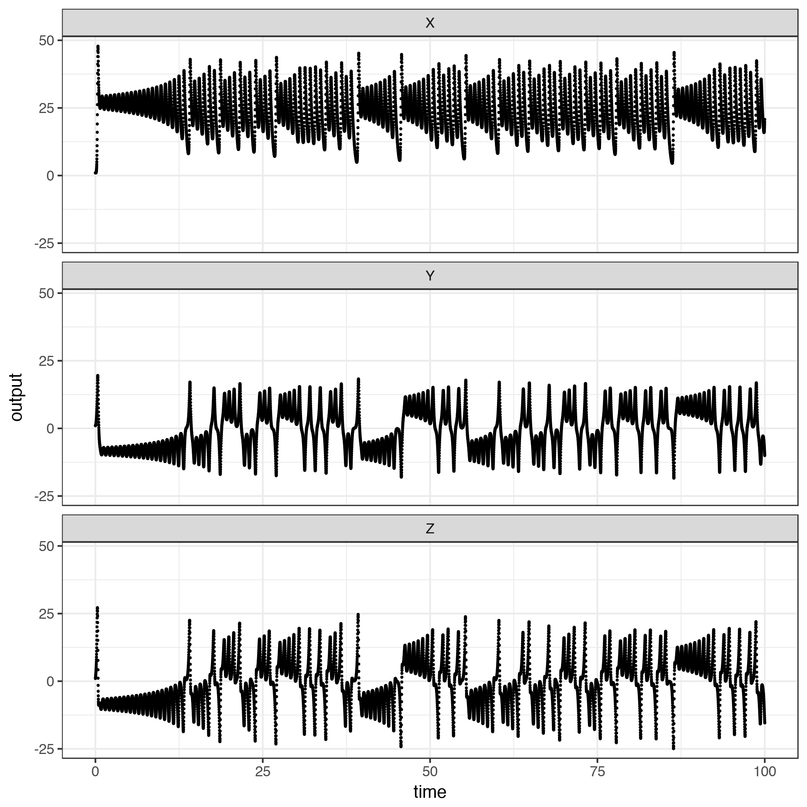
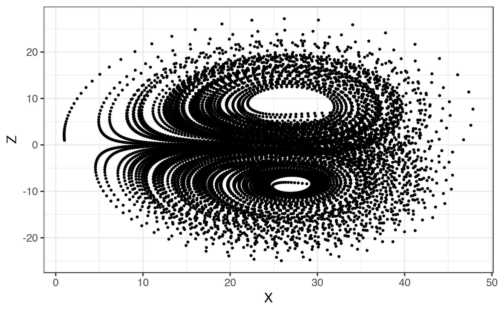
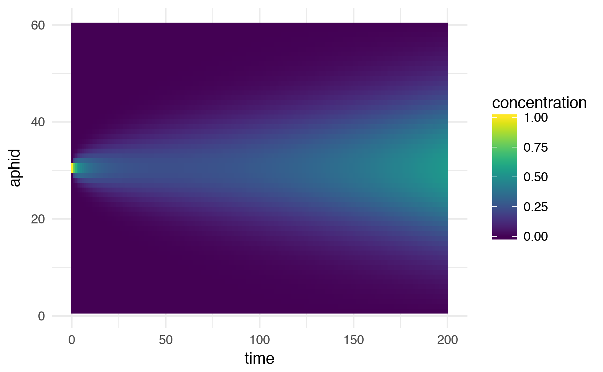
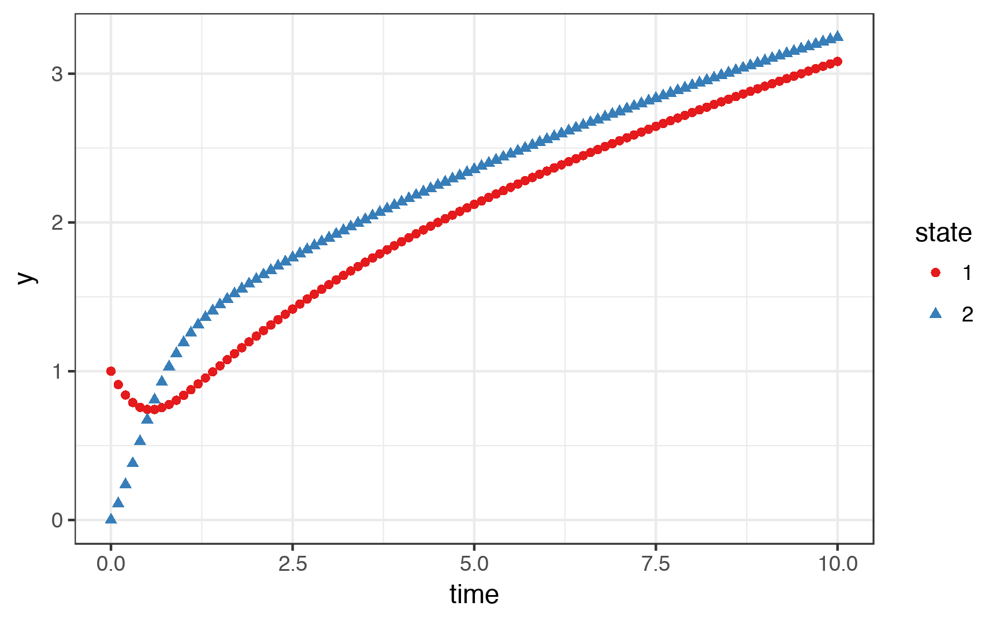
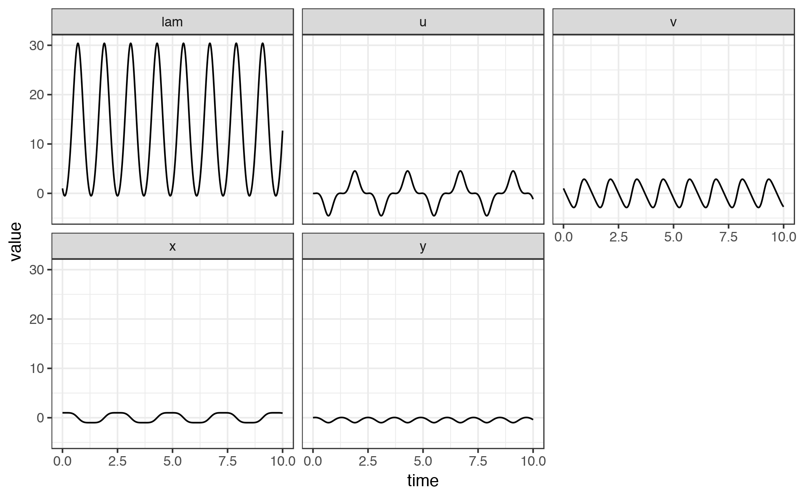
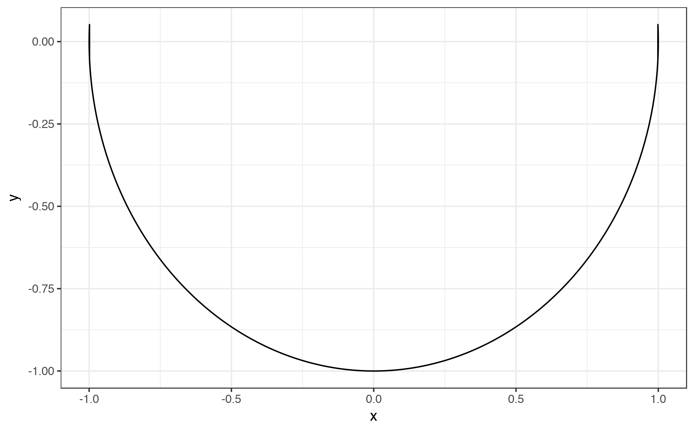
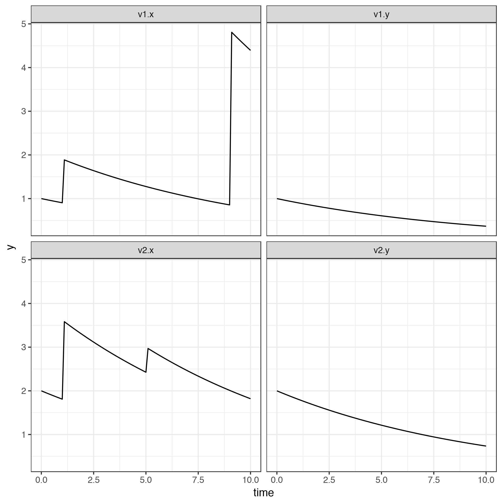

# Goal

In this post we will practice a few examples from Karline Soateart package 
*ReacTran*. [@Soetaert:2017wu] My goal by practicing how to solve PDEs and ODEs 
is to simulate drug delivery from our affinity polymers. [@Soetaert:2015wb]Our 
model should incorporate the affinity binding strength K~D~. We can predict K~D~
using Alison Xin's model. If we can input the K~D~ onto a PDE model we could 
simulate the release of any small molecule. Furthermore we could understand for
which drugs, or classes of drugs, our model assumptions hold true and provide 
alternative hypothesis for molecules that can't be predicted. If our hypothesis
is correct we should be able to pursue drug delivery projects more effectively.
Furthermore, we should be able to evolve molecules with low affinities towards
cyclodextrins into molecules with stronger affinities. Alternatively, we could
co-evolve molecules with high biological target specificity and appropriate 
affinity for the drug delivery device.

First things first.

## Weather Lorenz ODE example

### Load deSolve
```{r eval = FALSE}

library(deSolve)

```

The first example is a Lorenz type of system. Of special interest in the 
vignette is the discussion of the 6 parts of modeling ODE's with R. These are,

* Model specification  
  + Parameters and their values
  + State variables and their initial conditions
  + Equations that calculate the rate of change of the state variables
* Model application  
  + Specify time input
  + Use desolve function to solve ode
  + Visualize results
 
### Model specification

As discussed above the model specification refers to parameters, state variables
and initial conditions, and equations that calculate the rate of change of the 
state variables. The equations providing the rate of change of the state 
variables are given in a function.

```{r eval = F}
# model parameters
parameters <- c(a = -8/3,
                b = -10,
                c = 28)
# state variables and initial conditions

state = c(X = 1,
          Y = 1,
          Z = 1)
# Model equations

Lorenz <- function(t, state, parameters){
  with(as.list(c(state, parameters)), {
    # rate of change
    dX <- a * X + Y*Z
    dY <- b * (Y - Z)
    dZ <- -X*Y+ c*Y - Z
    
    # return the rate of change
    list(c(dX, dY, dZ))
  }
       )
}
```
### Model application

After the parameters have been assigned, state variables defined and the model
equations written on a function, we can proceed to the model application step.
The first step is the time specification. For the Lorenz example we are 
running from 0 to 100 seconds in 0.01s intervals. The second step is to provide 
the Lorenz function to an ode solver from desolve to obtain the solution to the 
model. After a solution is found we can proceed to visualize it.

```{r eval = F}

times <- seq(0, 100, by = 0.01)

out <- ode(y = state,
           times = times,
           func = Lorenz,
           parms = parameters)

```

We can then explore the output of the code by using head and dim. 

```{r eval = F}
head(out)
dim(out)
```

From the output of the ode solver we can see that we have 4 columns. The output
appropriately has 10001 rows corresponding to the length of the vector times.
There are four columns in the output corresponding to the time vector, which is
automatically named by the solver, and the three state variables provided to ode
via the y input in the ode call. 

The final step is visualizing the solution. Instead of using plot as in the 
vignette we will use ggplot.

```{r eval = F}
library(tidyverse)
library(Cairo)
out_frame <- out %>% 
  as.data.frame() %>%  # using as.data.frame() since as_data_frame() keeps the matrix class
  gather(key = "state", value = "output", -time) 
lorenz_plot <- ggplot(out_frame, aes(x = time, y = output))+
  geom_point(size = 0.25)+
  facet_wrap(~state,nrow = 3)+
  theme_bw()

# ggsave(plot = lorenz_plot, filename = "01_State-Variables-vs-Time-Lorenz.png", path = "./images", type = "cairo-png")
```



We can see here the behavior of each state variable from the Lorenz equation.
Another plot that is usually visualized for this equation is the one state
variable in the x axis and another in the y. We can easily replicate this in 
ggplot.

```{r eval = F}
out_frame %>%
  filter(state %in% c("Z","X")) %>%
  spread(key = state, value = output) %>%
  ggplot(., aes(x = X, y = Z))+
  geom_point(size = 0.5)+
  theme_bw()

ggsave(filename = "02_X-vs-Z-Lorenz.png", path = "./images/", type = "cairo-png")
```


 Voila! We are able to obtain via ggplot the output of the Lorenz differential 
 equation.  
 
 I should add a description of the purpose of the Lorenz function to 
 highlight the need for ODE modeling.
 
 To checkout if there were any problems in 
 the call to ode one can use the diagnostics function from desolve

```{r echo = F, eval = F}
diagnostics(out)
```


### Some thoughts on the ode function

The ode() function takes the following arguments  

|ode|ode.1D|radau|
|---|------|-----|
|y|try|  
|times|test|  
|func| test| 
|parms|  test|
|method|  test|
|x|  test|
|object|test|
|which|  test|
|select|  test|
||  test|
|$\ldots$|test|
|example|test|
|notes|test|
   

## Solving PDEs with desolve
Partial differential equations are diferential equations that include a state 
variable that like ODEs changes in time but also describes changes in space. In
the vignette for deSolve PDEs are discussed in the example of a  pest spreading 
along a line of trees in 1D.

The first equation relates the change in aphids with respect to the change in 
flux in space with a generation term.  


$$\frac{dN}{dt} = \frac{\partial Flux}{\partial x} + gN$$


The second equation describes how the flux is a product of the aphid diffusivity
and the rate of change of aphid in 1 dimensional space  

$$Flux = -D \frac{\partial N}{\partial x}$$


Analyzing this equation, it seems it really comes from the following equation:  


$$ \frac{dN}{dt} = -D \frac{\partial^2 N}{\partial x^2} + gN$$
with state variables:
N which is the number of aphids 
x which is the spatial dimension in $\textit m$

with parameters:  
D which is the diffusivity of Aphids in $\frac{m^2}{day}$  
g rate of generation parameter in $\frac{aphids}{day}$

Solution: Write as system of two equations and discretize the lower level?

These equations are then discretized in the spatial domain. In particular the
first equation is discretized using a centered difference and the second 
equation uses a lagging difference?
```{r eval = F}

# ODE Function
Aphid <- function(t, APHIDS, parameters){
        deltax <- c(0.5, rep(1, numboxes - 1), 0.5) # Must match length, but why 0.5? 61 spaces for deltax
        Flux <- - D * diff(c(0 ,APHIDS, 0))/ deltax # Must match length, but why 0? Because there's nothing at the edges as a boundary condition. 62 spaces for the numerator. Diff reduces length of vector by 1.
        dAPHIDS <- -diff(Flux)/delx + r * APHIDS

list(dAPHIDS)
}

# Parameters
D <- 0.3 # m2/day diffusion rate
r <- 0.01 # Aphids/day generation rate
numboxes <- 60 # How big the field is in meters
delx <- 1 # thicknes of boxes

# Initial Conditions
APHIDS <- rep(0, times = numboxes) # initializing the 60 boxes with zeros
APHIDS[30:31] <- 1 # Only aphids at the center
state <- c(APHIDS = APHIDS) # initialize state variable

# Set time 
times <- seq(0, 200, by = 1)

# deSolve call
aphid_out <- ode.1D(y = state, 
       times = times, 
       func = Aphid,
       parms = 0, 
       nspec = 1, 
       names = "Aphid")

# dim(aphid_out) # aphid_out has the dimensions corresponding to 201 rows for time and 61 columns corresponding to the x axis

# Visualization
library(stringr)
library(viridis)
as.data.frame(aphid_out) %>%
  gather(key = "aphid", value = "concentration", -time) %>%
  mutate(aphid = str_replace(aphid, pattern = "[A-Z]+",replacement = "") %>% as.numeric) %>%
  ggplot(., aes(x = time, y = aphid)) +
  geom_raster(aes(fill = concentration), interpolate = F)+
  scale_fill_viridis()+
  theme_minimal()
ggsave(filename = "03_aphid-1d-vs-time.png", path = "./images/", type = "cairo-png")  

```


After writing this equation I have some doubts.

   1. How does one determines the length and values of the deltax vector? 
   Easy it must be the same length as the numerator after diference is taken. Diff will remove 1 element from your numerator.
   2. How does one determines to use diff with the vector inside of it the Flux
   term? 
   Because the equation says so.
   3. How does one determines to use diff again but this time instead of using
   deltax? 
   Because the flux is discretized we use delx.
   4. Why does the author changes notation of the state variable from N to 
   APHIDS?
   Authors choice.

## Differential algebraic equations with deSolve

deSolve functions radau and daspk are capable of solving algebraic differential equations in R. The function radau makes use of an implicit runge-kutta solver. The function daspk uses a backward differentiation method. According to Soetaert etal inputs to radau and daspk require particular forms. Function radau solves problems up to index 3 and daspk solving problems with maximum index of 1. We'll figure what that means in a minute.

radau 
 
 $$M (y') = f(t, y , y') $$
  
daspk

  $$F(t, y, y') = 0$$

For daspk the DAE must be written as something called a residual function rather than the rate equations seen in prior sections for ODEs and PDEs. The example given is the following:

$$\frac{dy[1]}{dt} = - y[1] + y[2] $$


$$y[1]*y[2] = t $$

```{r eval = F}
daefun <- function(t, y, dy, parameters){
  res1 <- dy[1] + y[1] - y[2]
  res2 <- y[2] * y[1] - t
  
  list(c(res1, res2))
}
  yini <- c(1,0)
  dyini <- c(1,0)
  times <- seq(0, 10, 0.1)
  out <- daspk(y = yini, 
               dy = dyini, 
               times = times,
               res = daefun,
               parms = 0)


dim(out)
head(out)
```

The output given is the value of the state variable 1 and 2 evaluated in the times given by the times vector. In this example the nomenclature of the  state variables (e.g. dy[1], y[1] and y[2]) uses brackets.

### Plotting the DAE solution
```{r eval = F}
out %>%
  as.data.frame %>%
  gather(key = "state", value = "y", -time) %>%
  ggplot(., aes(x = time, y = y, color = state))+
  geom_point(aes(shape = state))+
  theme_bw()+
  scale_color_brewer(palette = "Set1")
ggsave(filename = "04_y-vs-x-DAE.png",path = "./images/", type = "cairo-png")
```



### DAE of higher index with radau to solve the pendulum equation
radau solves DAE of the kind of 

$$ M(y') = F(t, y, y')$$

$$\begin{align*}
& x' = u \\
& y' = v \\ 
& u' = -L * x \\ 
& v' = -L * y - 9.8 \\ 
& 0 = x^2 + y^2 - 1 \\
\end{align*}$$  

x, y, u, v, L are dependant variables

```{r eval = F}
pendulum <- function(t, Y, parms){
  with(as.list(Y),
       list(c(u,
              v,
              -lam * x,
              -lam * y - 9.8,
              x^2 + y^2 - 1))
       )
}
yini <- c(x = 1, y = 0, u = 0, v = 1, lam = 1)
M <- diag(nrow = 5)
M[5, 5] <- 0
index <- c(2,2,1)
times <- seq(from = 0, to = 10, by = 0.01)
out <- radau(y = yini, func = pendulum, parms = NULL, times = times, mass = M, nind = index)

```


```{r eval = F}
out %>%
  as.data.frame() %>%
  gather(key = "state", value = "value", -time) %>%
  ggplot(., aes(x = time, y = value))+
  geom_line()+
  facet_wrap(~state)+
  theme_bw()
ggsave(filename = "05_var-vs-time.png", path = "./images/", type = "cairo-png")
```


```{r eval = F}
out %>%
  as.data.frame() %>%
  gather(key = "state", value = "value", -time) %>%
  filter(state %in% c("x", "y")) %>%
  spread(key = state, value = value) %>%
  ggplot(., aes(x = x, y = y))+
  geom_line()+
  theme_bw()
ggsave(filename = "06_y-vs-x.png", path = "./images/", type = "cairo-png")
```


The other two following examples explore using ODEs with irrational number 
inputs and jacobian matrix based functions. Which we are going to skip for now
in order to keep making progress towards our goal of using ode and pde in r to
simulate drug release profiles.

## Events and roots

Equations can be modified in one of two ways. First an event can be triggered at 
at predetermined time. Second, a root function can be provided which triggers
a secondary function once a condition on the main function has been met. In
deSolve events can be specified by providing a function call in a data frame 
with 4 columns (var, time, value and method) to the events argument in the ode 
function. Note that the events argument must be provided as a list. For root 
functions a root function specifiying which state variable will be modified is 
written together with an events function. These two functions are passed to the
events argument inside of deSolve's ode as a list. For more information on 
implementing roots and events with deSolve read the events documentation.

### Events with data frame specified

```{r eval = F}
eventmod <- function(t, var, parms){
  list(dvar = -0.1 * var)
}
# Declare state variables
yini <- c(v1 = 1, v2 = 2)

# Call time vector
times <- seq(0,10, by = 0.1)

# Declare when the events will take place
eventdat <- data.frame(var = c("v1", "v2", "v2", "v1"),
                       time = c(1, 1, 5, 9),
                       value = c(1, 2, 3, 4),
                       method = c("add", "mult", "rep", "add")
                       )

# Call the solver
out <- ode(func = eventmod, 
           y = yini, 
           times = times,
           parms = NULL, 
           events = list(data = eventdat)
           )

out_2 <- ode(func = eventmod, 
           y = yini, 
           times = times,
           parms = NULL
           )

out %>% 
  as.data.frame() %>%
  inner_join(as.data.frame(out_2), by = "time") %>%
  gather(key = "state", value = "y", -time) %>%
  ggplot(.,aes(x = time, y = y))+
  geom_line()+
  facet_wrap(~state, ncol = 2)+
  theme_bw()
ggsave(filename = "07_y-vs-t_event-ode.png", path = "./images/", type = "cairo-png")
  


  
  

```

### Events triggered by a root function
```{r}

ballode <- function(t, y, parms) {
  dy1 <- y[2]
  dy2 <- -9.8
  list(c(dy1, dy2))
}

root <- function(t, y, parms) y[1]

event <- function(t, y, parms){
  y[1] <- 0
  y[2] <- -0.9*y[2]
  return(y)
}

yini <- c(height = 0, v = 20)
times <- seq(from = 0, to = 20, by = 0.01)
out <- lsode(y = yini, times = times, func = ballode, parms = NULL, 
           events = list(func = event, root = T), rootfun = root)

out %>%
  as.data.frame() %>%
  ggplot()+
  geom_point(aes(x = time, y = height))+
  theme_bw()

```

There were some things I found difficult to grasp when implementing this example
from memory.  
 
 (@) I don't quite understand why ballode must return a list and why
state variables can be written in bracket notation.   
Answer from ode's documentation:

>The return value of func should be a list, whose first element is a vector containing the derivatives of y with respect to time, and whose next elements are global values that are required at each point in times. The derivatives must be specified in the same order as the state variables y.  

 (@) Also I don't understand why the event function must explicitly return y.  
 According to the documentation this is the way that the event function must be
 written

Delayed differential equations are implemented in a similar fashion as regular ode's
but won't be discussed in this document.

# Following along Schieser's Book

In this trial we will follow William Shchieser example in his book of analyzing
partial differential equations in R using the method of lines. In general Schieser approaches the solution of PDEs by making use of three main parts.  
    1. A main program providing  
       i) All the files and fx sourced into the program which contain  the derivative approximations 
       ii) The parameters explored  
       iii) The choice for the spatial derivative  
       iv) The level of output  
       v) The initial conditions  
        
       vi) The ode call to solve the system of equations  
    2. A PDE definition function which calls an external function to solve the spatial derivative. 
    3. An external function to resolve the timestep  

# Appendix


# References


